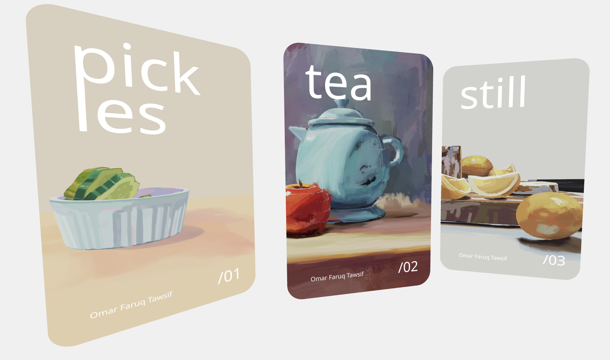

## Notes
useRoute, setLocation: get/set path to trigger effect
```
const [, params] = useRoute('/item/:id')
const [, setLocation] = useLocation()

onDoubleClick={e => (e.stopPropagation(), setLocation('item/' + e.object.name))}
``` 


[**Live Demo**](https://momentchan.github.io/r3f-enter-portal/)